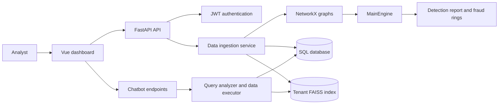
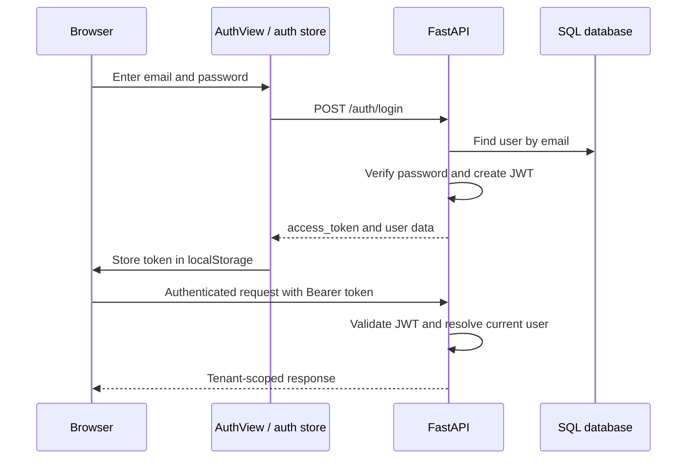
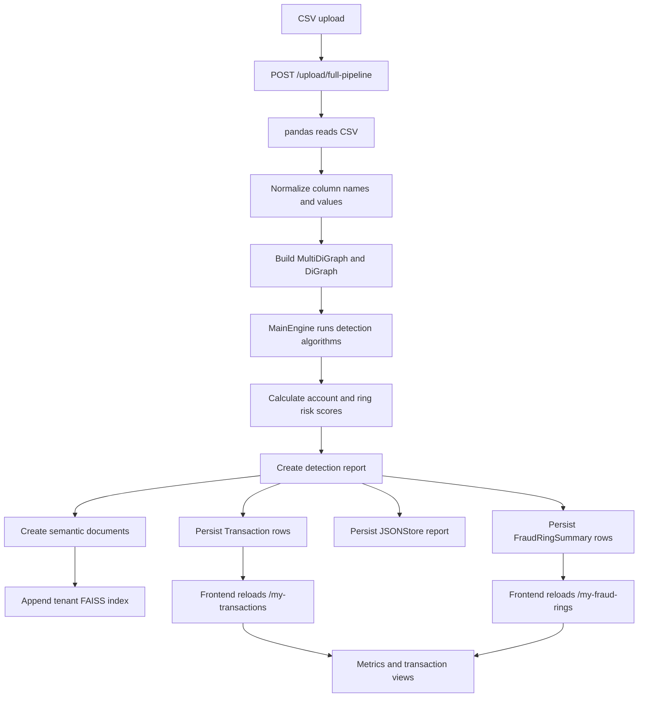
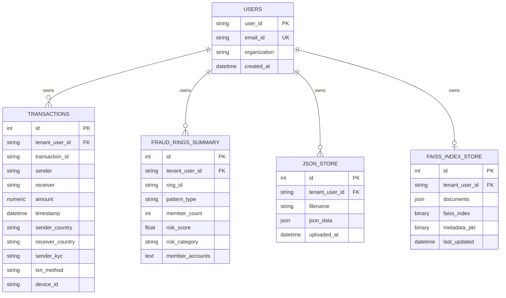
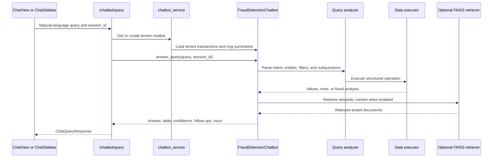

# FlowMatrix: Money Laundering Detection Platform

FlowMatrix is a full-stack transaction-analysis application. Users upload transaction CSV files, the backend builds account graphs, detects suspicious patterns and fraud rings, stores tenant-scoped results, and exposes the results through a Vue dashboard and a natural-language chatbot.

## Contents

- [System Overview](#system-overview)
- [Repository Layout](#repository-layout)
- [Technology Stack](#technology-stack)
- [Running the Project](#running-the-project)
- [Architecture and Data Flow](#architecture-and-data-flow)
- [Backend Reference](#backend-reference)
- [Fraud Detection Engine](#fraud-detection-engine)
- [Database Model](#database-model)
- [Chatbot and Semantic Search](#chatbot-and-semantic-search)
- [Frontend Reference](#frontend-reference)
- [API Reference](#api-reference)
- [CSV Input Contract](#csv-input-contract)
- [Known Integration Notes](#known-integration-notes)
- [Related Documentation](#related-documentation)

## System Overview



The application treats each registered user as a tenant. Transactions, fraud-ring summaries, reports, vector indexes, and chatbot data access are associated with that user's `user_id`.

## Repository Layout

```text
6th-sem-project-main/
├── backend/                 FastAPI application and detection pipeline
├── frontend/                Vue 3 and Vite single-page application
├── .vscode/                 Workspace/editor configuration
├── .gitignore               Git ignore rules
└── PROJECT_DOCUMENTATION.md This document
```

## Technology Stack

### Backend

- Python, FastAPI, Uvicorn
- Pydantic and pydantic-settings for request models and configuration
- SQLAlchemy async sessions with PostgreSQL/`asyncpg` support and a synchronous startup engine
- pandas for CSV processing
- NetworkX for transaction graphs
- NumPy, SciPy, and scikit-learn for scoring and metrics
- `sentence-transformers` and PyTorch for embeddings
- FAISS CPU for semantic retrieval
- `python-jose`, Passlib, and bcrypt-compatible hashing for JWT authentication

### Frontend

- Vue 3
- Vite
- Vue Router with hash history
- Pinia stores
- Axios API client
- `gh-pages` deployment script

## Running the Project

### Backend

From the repository root:

```bash
python -m venv .venv
source .venv/bin/activate
pip install -r backend/requirements.txt
```

Configure the environment values expected by [backend/core/config.py](backend/core/config.py), especially the database URL and JWT secret. The backend can then be started with:

```bash
./backend/start.sh
```

`start.sh` runs Uvicorn on `0.0.0.0:10000` and imports `backend.main:app`.

The application also supports:

```bash
python backend/main.py
```

That code path initializes tables and starts on port `8000`.

Useful backend URLs:

- API root: `http://127.0.0.1:8000/` or the port selected at startup
- Swagger UI: `/docs`
- ReDoc: `/redoc`
- Health check: `/health`

### Frontend

```bash
cd frontend
npm install
npm run dev
```

The Vite development server runs at `http://localhost:5173`. Build and preview commands are:

```bash
npm run build
npm run preview
```

The production deployment script builds `dist/` and publishes it with `gh-pages`.

## Architecture and Data Flow

### Authentication Flow



### Full Detection Flow



### Legacy Detection Flow

`POST /upload/detect` remains available for the original multi-file workflow. It uses [backend/service/run_pipeline.py](backend/service/run_pipeline.py), writes temporary tenant files, and returns a legacy response shaped roughly as `{ filename: { report, summary } }`. The frontend store still supports this shape, but the current Home view uses `/upload/full-pipeline` because it persists data for later views and chatbot queries.

### Frontend Navigation Flow

```mermaid
flowchart TD
    Main[main.js] --> App[App.vue]
    App --> Router[Vue Router]
    Router --> Auth[/auth AuthView]
    Router --> Home[/ HomeView]
    Router --> Summary[/summary SummaryView]
    Router --> Graph[/graph GraphView]
    Router --> Metrics[/metrics MetricsView]
    Router --> Transactions[/transactions TransactionsView]
    Router --> Chat[/chat ChatView]
    App --> Navbar[AppNavbar]
    App --> Sidebar[ChatSidebar]
    Views[Views] --> APIClient[services/api.js]
    APIClient --> Backend[FastAPI]
    Views --> Stores[Pinia auth/results stores]
```

## Backend Reference

### Entry point and application setup

- [backend/main.py](backend/main.py): creates the FastAPI application, configures permissive CORS, registers authentication, user, detection, and chatbot routers, and exposes root metadata. `init_db()` creates SQLAlchemy tables using the synchronous database URI.
- [backend/start.sh](backend/start.sh): starts Uvicorn on port `10000`.
- [backend/requirements.txt](backend/requirements.txt): pinned Python dependency list.

### API routes

- [backend/api/__init__.py](backend/api/__init__.py): API package marker.
- [backend/api/auth.py](backend/api/auth.py): registration, login, and client-side logout routes under `/auth`.
- [backend/api/user.py](backend/api/user.py): authenticated `/users/me` profile route.
- [backend/api/routes.py](backend/api/routes.py): CSV upload, detection, reports, transactions, fraud rings, vector-index deletion, session cleanup, and system health routes.
- [backend/api/chatbot_route.py](backend/api/chatbot_route.py): chatbot sessions, natural-language queries, dataset information, vector database operations, and chatbot cache operations.

### Authentication

- [backend/auth/__init__.py](backend/auth/__init__.py): authentication package marker.
- [backend/auth/auth.py](backend/auth/auth.py): authentication-related package implementation.
- [backend/auth/deps.py](backend/auth/deps.py): FastAPI dependency that reads the Bearer token, validates it, and returns the current tenant user.
- [backend/core/security.py](backend/core/security.py): password hashing/verification and JWT creation.

### Configuration and helpers

- [backend/core/__init__.py](backend/core/__init__.py): core package marker.
- [backend/core/config.py](backend/core/config.py): environment-backed application, database, and vector settings.
- [backend/core/helper.py](backend/core/helper.py): converts NumPy and other non-JSON-native values before API responses.

### Database and schemas

- [backend/database/__init__.py](backend/database/__init__.py): database package marker.
- [backend/database/base.py](backend/database/base.py): SQLAlchemy declarative base.
- [backend/database/session.py](backend/database/session.py): database engine/session configuration and FastAPI database dependency.
- [backend/database/model.py](backend/database/model.py): ORM models described in [Database Model](#database-model).
- [backend/schema/__init__.py](backend/schema/__init__.py): schema package marker.
- [backend/schema/user.py](backend/schema/user.py): registration and user response validation models.
- [backend/schema/files.py](backend/schema/files.py): JSON report and FAISS store schema models.
- [backend/schema/chatbout.py](backend/schema/chatbout.py): chatbot request/response models. The filename is `chatbout.py` in the repository.

### Detection and graph modules

- [backend/graphs/__init__.py](backend/graphs/__init__.py): graph package marker.
- [backend/graphs/build_graph.py](backend/graphs/build_graph.py): maps flexible input headers to canonical transaction fields, validates required columns, cleans values, and constructs NetworkX graphs.
- [backend/graphs/engine.py](backend/graphs/engine.py): `MainEngine`, which detects patterns, scores accounts, forms rings, and generates reports.
- [backend/graphs/validation.py](backend/graphs/validation.py): graph input validation exceptions, including `InvalidColumnsError`.
- [backend/graphs/graph_algo.md](backend/graphs/graph_algo.md): existing detailed algorithm and scoring README. It documents the ten detection algorithms, six scoring dimensions, adaptive thresholding, ring formation, and evaluation metrics.

### Services

- [backend/service/__init__.py](backend/service/__init__.py): service package marker.
- [backend/service/ingestion.py](backend/service/ingestion.py): canonical ingestion service. It reads and normalizes uploaded CSV data, runs `MainEngine`, writes database records, creates report documents, and manages FAISS indexing.
- [backend/service/run_pipeline.py](backend/service/run_pipeline.py): legacy multi-file temporary-file pipeline used by `/upload/detect`.
- [backend/service/download.py](backend/service/download.py): lists, downloads, converts, and deletes tenant reports.
- [backend/service/user_service.py](backend/service/user_service.py): user creation and lookup operations.
- [backend/service/chatbot_service.py](backend/service/chatbot_service.py): loads tenant transactions and fraud summaries, creates cached chatbot instances, manages vector stores, and converts table results to API-safe data.

### Embedding services

- [backend/service/embeddings/create_vector_db.py](backend/service/embeddings/create_vector_db.py): creates CPU sentence-transformer embeddings and handles model/cache setup.
- [backend/service/embeddings/fiass_calculate.py](backend/service/embeddings/fiass_calculate.py): tenant-specific FAISS index creation, persistence, retrieval, statistics, and deletion. The filename is `fiass_calculate.py` in the repository.

### Chatbot modules

- [backend/chatbot/__init__.py](backend/chatbot/__init__.py): chatbot package exports and vector availability state.
- [backend/chatbot/main_chatbot.py](backend/chatbot/main_chatbot.py): central chatbot orchestration and query dispatch.
- [backend/chatbot/enhanced_query_analyzer.py](backend/chatbot/enhanced_query_analyzer.py): preprocessing, intent detection, entity/filter extraction, aggregation detection, and multi-question parsing.
- [backend/chatbot/query_analysis.py](backend/chatbot/query_analysis.py): query analysis and calculation helpers.
- [backend/chatbot/data_executor.py](backend/chatbot/data_executor.py): executes selections, filters, sorting, grouping, aggregations, and fraud-analysis operations against pandas data.
- [backend/chatbot/answer_construction.py](backend/chatbot/answer_construction.py): converts results into natural-language answers, tables, follow-up suggestions, and optional traces.
- [backend/chatbot/conversation_memory_manager.py](backend/chatbot/conversation_memory_manager.py): maintains per-session conversation history and follow-up context in process memory.
- [backend/chatbot/vector_retriever.py](backend/chatbot/vector_retriever.py): optional semantic retrieval against FAISS documents.
- [backend/chatbot/text_processor.py](backend/chatbot/text_processor.py): query text normalization and processing.
- [backend/chatbot/spell_checker.py](backend/chatbot/spell_checker.py): spelling correction support.
- [backend/chatbot/kerword_extractor.py](backend/chatbot/kerword_extractor.py): keyword extraction helpers. The filename is intentionally spelled `kerword_extractor.py`.
- [backend/chatbot/domain_vocabulary.py](backend/chatbot/domain_vocabulary.py): finance, fraud, and transaction vocabulary.
- [backend/chatbot/fallback.py](backend/chatbot/fallback.py): low-confidence and unsupported-query responses.

## Fraud Detection Engine

The engine models accounts as nodes and transfers as directed edges. It builds both a transaction `MultiDiGraph` and an account-level `DiGraph`, then combines graph structure and transaction context into account-level scores and fraud-ring summaries.

The documented pattern detectors are:

1. Cycles
2. Fan-in and fan-out smurfing
3. Layered shells
4. Cross-border chains
5. Unverified KYC clusters
6. Round-amount activity
7. Device sharing
8. New-account bursts
9. Velocity spikes
10. Rapid movement through accounts

The score combines structural, behavioral, statistical, network, contextual, and legitimate-account signals. Scores are normalized to a 0-100 range, categorized into risk levels, and grouped into non-overlapping `RING_001`-style summaries.

The implementation currently clamps cycle lengths to 3 through 6. For formulas, thresholds, examples, performance metrics, and the full algorithm explanation, see [backend/graphs/graph_algo.md](backend/graphs/graph_algo.md).

## Database Model



All child records use foreign keys to `users.user_id` with cascade deletion. `FaissIndexStore` is one-to-one with a tenant; the other data relationships are one-to-many.

## Chatbot and Semantic Search



During ingestion, semantic documents are generated for dataset statistics, country distribution, payment methods, KYC distribution, high-value transactions, temporal patterns, fraud summaries, and suspicious accounts. The index is appended per tenant when embedding flags are enabled. Chatbot conversation history and the in-process chatbot cache are not durable across backend restarts.

## Frontend Reference

### Application shell

- [frontend/index.html](frontend/index.html): HTML entry document.
- [frontend/src/main.js](frontend/src/main.js): mounts Vue, Pinia, the router, and global styles.
- [frontend/src/App.vue](frontend/src/App.vue): application shell, background, navbar, routed content, and floating chatbot.
- [frontend/src/assets/main.css](frontend/src/assets/main.css): global styling and layout rules.
- [frontend/vite.config.js](frontend/vite.config.js): Vite configuration, development server, proxy, and `/Money_muling/` base path.
- [frontend/vue.config.js](frontend/vue.config.js): Vue CLI-era configuration retained in the project.
- [frontend/package.json](frontend/package.json): scripts and dependencies.
- [frontend/package-lock.json](frontend/package-lock.json): locked npm dependency versions.
- [frontend/README.md](frontend/README.md): frontend quick-start and feature notes.

### Views and routes

| Hash route | File | Responsibility |
| --- | --- | --- |
| `#/auth` | [AuthView.vue](frontend/src/views/AuthView.vue) | Login and registration |
| `#/` | [HomeView.vue](frontend/src/views/HomeView.vue) | CSV upload and full detection pipeline |
| `#/summary` | [SummaryView.vue](frontend/src/views/SummaryView.vue) | Fraud-ring summary table |
| `#/graph` | [GraphView.vue](frontend/src/views/GraphView.vue) | Interactive graph view |
| `#/metrics` | [MetricsView.vue](frontend/src/views/MetricsView.vue) | KYC, payment, country, risk, and transaction metrics |
| `#/transactions` | [TransactionsView.vue](frontend/src/views/TransactionsView.vue) | Searchable, sortable, paginated transaction table |
| `#/chat` | [ChatView.vue](frontend/src/views/ChatView.vue) | Full chatbot interface |

[frontend/src/router/index.js](frontend/src/router/index.js) uses hash history and redirects unauthenticated users to `/auth`. [frontend/src/views/ChartsView.vue](frontend/src/views/ChartsView.vue) exists but is not registered in the router.

### Components

- [frontend/src/components/AppNavbar.vue](frontend/src/components/AppNavbar.vue): navigation, logout, reload, and client-side exports.
- [frontend/src/components/FileUpload.vue](frontend/src/components/FileUpload.vue): multi-file CSV selection/dropzone.
- [frontend/src/components/SummaryTable.vue](frontend/src/components/SummaryTable.vue): fraud-ring table presentation.
- [frontend/src/components/StatCards.vue](frontend/src/components/StatCards.vue): summary statistics cards.
- [frontend/src/components/GraphView.vue](frontend/src/components/GraphView.vue): graph visualization component used by the graph view.
- [frontend/src/components/ChatSidebar.vue](frontend/src/components/ChatSidebar.vue): floating chatbot panel.
- [frontend/src/components/ChatSidebar.vue.bak](frontend/src/components/ChatSidebar.vue.bak): backup copy of the chatbot sidebar.

### Services and state

- [frontend/src/services/api.js](frontend/src/services/api.js): Axios client, JWT injection, 401/403 handling, authentication calls, upload calls, data retrieval, reports, chatbot, and vector-index calls.
- [frontend/src/stores/auth.js](frontend/src/stores/auth.js): token persistence, login/register/profile state, startup validation, and logout.
- [frontend/src/stores/results.js](frontend/src/stores/results.js): transactions, rings, reports, pipeline statistics, derived metrics, graph data, and normalization of legacy/full-pipeline/database response shapes.

The results store reconstructs graph edges from fraud-ring members when loading database summaries, because the stored ring summary does not include the original transaction edge list.

## API Reference

All routes except registration, login, root, and health require an `Authorization: Bearer <JWT>` header.

### Authentication and users

| Method | Endpoint | Purpose |
| --- | --- | --- |
| `POST` | `/auth/register` | Create a user/tenant |
| `POST` | `/auth/login` | Return a JWT using form fields `username` and `password` |
| `POST` | `/auth/logout` | Inform the client to delete its token |
| `GET` | `/users/me` | Return the current user profile |

### Detection, reports, and data

| Method | Endpoint | Purpose |
| --- | --- | --- |
| `POST` | `/upload/full-pipeline` | Process one CSV, persist data, and optionally build embeddings |
| `POST` | `/upload/detect` | Legacy multi-file detection pipeline |
| `POST` | `/session/cleanup` | Delete temporary files for the current tenant |
| `GET` | `/my-reports` | List tenant reports |
| `GET` | `/download/json/{file_name}` | Download a JSON report |
| `GET` | `/download/csv/{file_name}` | Download a CSV summary |
| `DELETE` | `/reports/{analysis_name}` | Delete an analysis and its report files |
| `GET` | `/my-transactions` | Return paginated tenant transactions |
| `GET` | `/my-fraud-rings` | Return paginated rings sorted by risk |
| `DELETE` | `/index` | Delete the tenant FAISS index |
| `GET` | `/health` | Return API health status |

### Chatbot and vector search

| Method | Endpoint | Purpose |
| --- | --- | --- |
| `POST` | `/chatbot/query` | Answer a natural-language data question |
| `GET` | `/chatbot/session/{session_id}` | Read conversation history |
| `POST` | `/chatbot/session/{session_id}/reset` | Reset conversation history |
| `GET` | `/chatbot/dataset/info` | Return dataset distributions and amount statistics |
| `POST` | `/chatbot/vector-db/build` | Build or rebuild the tenant vector database |
| `GET` | `/chatbot/vector-index/stats` | Return vector-index statistics |
| `DELETE` | `/chatbot/vector-index` | Delete vector artifacts without deleting database rows |
| `DELETE` | `/chatbot/cache` | Clear the cached chatbot instance |

## CSV Input Contract

The graph builder accepts flexible header names by matching patterns, but the logical fields are:

| Canonical field | Required | Used for |
| --- | --- | --- |
| `transaction_id` | Yes | Transaction identity |
| `sender` | Yes | Source account node |
| `receiver` | Yes | Destination account node |
| `amount` | Yes | Transfer value and scoring |
| `timestamp` | Yes | Temporal and velocity analysis |
| `sender_country` | No | Cross-border analysis and distributions |
| `receiver_country` | No | Cross-border analysis |
| `sender_kyc` | No | Unverified-account clusters |
| `txn_method` | No | Payment-method analysis |
| `device_id` | No | Device-sharing detection |
| `sender_acct_age` | No | New-account bursts |
| `velocity_mins` | No | Velocity spikes |
| `is_round_amount` | No | Round-amount detection |

Normalization converts amounts, timestamps, booleans, and optional fields into forms accepted by the graph engine and database models. Invalid or missing required columns are reported through graph validation errors.

## Known Integration Notes

- The frontend Axios base URL is `http://127.0.0.1:8000/`, while [backend/start.sh](backend/start.sh) starts on port `10000`. Align these values before using the shell script with the development frontend.
- Running [backend/main.py](backend/main.py) directly uses port `8000` and calls `init_db()` before starting.
- The frontend exports `chatbotHealth()` for `/chatbot/health`, but that route is currently commented out in [backend/api/chatbot_route.py](backend/api/chatbot_route.py). The general `/health` route remains available.
- `/upload/detect` is a legacy temporary-file workflow. `/upload/full-pipeline` is the persistent workflow used by the current dashboard.
- The first embedding operation may download and initialize the `intfloat/e5-small-v2` sentence-transformer model and can take substantial time and memory.
- Chatbot caches and conversation sessions are process-local. Restarting the backend clears them, while database transactions and persisted FAISS artifacts remain.
- FAISS and database operations are tenant-scoped through the authenticated user's ID; callers must not bypass the JWT dependency.
- `frontend/src/views/ChartsView.vue` is currently orphaned from the router and should be reviewed before being exposed.
- Backup files [ChatSidebar.vue.bak](frontend/src/components/ChatSidebar.vue.bak) and [HomeView.vue.bak](frontend/src/views/HomeView.vue.bak) are retained source snapshots, not active routes/components.

## Related Documentation

The detailed graph-engine explanation is maintained separately in [backend/graphs/graph_algo.md](backend/graphs/graph_algo.md). It contains the detector-by-detector descriptions, scoring formula, risk levels, adaptive threshold, fraud-ring formula, confusion matrix, and evaluation metrics. This document provides the project-wide context and links to that source of truth rather than replacing it.
